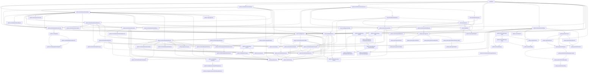

# Dependency Graph for `TUIOS`

```mermaid
flowchart TD

classDef goroot fill:#1D4,color:white
classDef cgofiles fill:#D52,color:white
classDef vendored fill:#D90,color:white
classDef buildErrs fill:#C10,color:white

1[./cmd/tuios]
click 1 href "https://godoc.org/./cmd/tuios"
1 --> 2
1 --> 3
1 --> 4
1 --> 5
1 --> 6
1 --> 7
1 --> 8
1 --> 9
1 --> 10
1 --> 11
1 --> 12
1 --> 13

2[github.com/tonk/tuios/internal/app]
click 2 href "https://godoc.org/github.com/tonk/tuios/internal/app"
2 --> 3
2 --> 14
2 --> 15
2 --> 16
2 --> 6
2 --> 17
2 --> 7
2 --> 9
2 --> 10
2 --> 18
2 --> 19
2 --> 20
2 --> 21
2 --> 22
2 --> 23

3[github.com/tonk/tuios/internal/config]
click 3 href "https://godoc.org/github.com/tonk/tuios/internal/config"
3 --> 24
3 --> 12

4[github.com/tonk/tuios/internal/input]
click 4 href "https://godoc.org/github.com/tonk/tuios/internal/input"
4 --> 2
4 --> 3
4 --> 16
4 --> 25
4 --> 7
4 --> 19

14[github.com/tonk/tuios/internal/layout]
click 14 href "https://godoc.org/github.com/tonk/tuios/internal/layout"
14 --> 3

15[github.com/tonk/tuios/internal/pool]
click 15 href "https://godoc.org/github.com/tonk/tuios/internal/pool"
15 --> 9

5[github.com/tonk/tuios/internal/server]
click 5 href "https://godoc.org/github.com/tonk/tuios/internal/server"
5 --> 2
5 --> 3
5 --> 7
5 --> 18
5 --> 26
5 --> 27
5 --> 28

16[github.com/tonk/tuios/internal/terminal]
click 16 href "https://godoc.org/github.com/tonk/tuios/internal/terminal"
16 --> 3
16 --> 15
16 --> 6
16 --> 25
16 --> 29
16 --> 9
16 --> 19
16 --> 30

6[github.com/tonk/tuios/internal/theme]
click 6 href "https://godoc.org/github.com/tonk/tuios/internal/theme"
6 --> 9
6 --> 11

17[github.com/tonk/tuios/internal/ui]
click 17 href "https://godoc.org/github.com/tonk/tuios/internal/ui"
17 --> 16

25[github.com/tonk/tuios/internal/vt]
click 25 href "https://godoc.org/github.com/tonk/tuios/internal/vt"
25 --> 19
25 --> 31
25 --> 20
25 --> 32
25 --> 33
25 --> 34

24[github.com/adrg/xdg]
click 24 href "https://godoc.org/github.com/adrg/xdg"
24 --> 35
24 --> 36

35[github.com/adrg/xdg/internal/pathutil]
click 35 href "https://godoc.org/github.com/adrg/xdg/internal/pathutil"

36[github.com/adrg/xdg/internal/userdirs]
click 36 href "https://godoc.org/github.com/adrg/xdg/internal/userdirs"
36 --> 35

37[github.com/anmitsu/go-shlex]
click 37 href "https://godoc.org/github.com/anmitsu/go-shlex"

7[charm.land/bubbletea/v2]
click 7 href "https://godoc.org/charm.land/bubbletea/v2"
7 --> 29
7 --> 19
7 --> 20
7 --> 38
7 --> 39
7 --> 40
7 --> 41

29[github.com/charmbracelet/colorprofile]
click 29 href "https://godoc.org/github.com/charmbracelet/colorprofile"
29 --> 20
29 --> 38
29 --> 42

8[github.com/charmbracelet/fang]
click 8 href "https://godoc.org/github.com/charmbracelet/fang"
8 --> 29
8 --> 9
8 --> 20
8 --> 43
8 --> 38
8 --> 44
8 --> 45
8 --> 13
8 --> 46
8 --> 47
8 --> 48

49[github.com/charmbracelet/keygen]
click 49 href "https://godoc.org/github.com/charmbracelet/keygen"
49 --> 50

9[charm.land/lipgloss/v2]
click 9 href "https://godoc.org/charm.land/lipgloss/v2"
9 --> 29
9 --> 19
9 --> 20
9 --> 51
9 --> 38
9 --> 39
9 --> 34

10[charm.land/lipgloss/v2/table]
click 10 href "https://godoc.org/charm.land/lipgloss/v2/table"
10 --> 9
10 --> 20

52[charm.land/log/v2]
click 52 href "https://godoc.org/charm.land/log/v2"
52 --> 29
52 --> 9
52 --> 53

18[github.com/charmbracelet/ssh]
click 18 href "https://godoc.org/github.com/charmbracelet/ssh"
18 --> 37
18 --> 54
18 --> 55
18 --> 50
18 --> 41

19[github.com/charmbracelet/ultraviolet]
click 19 href "https://godoc.org/github.com/charmbracelet/ultraviolet"
19 --> 29
19 --> 20
19 --> 56
19 --> 32
19 --> 38
19 --> 54
19 --> 57
19 --> 40
19 --> 34
19 --> 42
19 --> 58
19 --> 41

31[github.com/charmbracelet/ultraviolet/screen]
click 31 href "https://godoc.org/github.com/charmbracelet/ultraviolet/screen"
31 --> 19

26[charm.land/wish/v2]
click 26 href "https://godoc.org/charm.land/wish/v2"
26 --> 7
26 --> 49
26 --> 52
26 --> 18
26 --> 50

27[charm.land/wish/v2/bubbletea]
click 27 href "https://godoc.org/charm.land/wish/v2/bubbletea"
27 --> 7
27 --> 29
27 --> 52
27 --> 18
27 --> 26

28[charm.land/wish/v2/logging]
click 28 href "https://godoc.org/charm.land/wish/v2/logging"
28 --> 52
28 --> 18
28 --> 26

20[github.com/charmbracelet/x/ansi]
click 20 href "https://godoc.org/github.com/charmbracelet/x/ansi"
20 --> 32
20 --> 39
20 --> 33
20 --> 34

56[github.com/charmbracelet/x/ansi/kitty]
click 56 href "https://godoc.org/github.com/charmbracelet/x/ansi/kitty"
56 --> 20

32[github.com/charmbracelet/x/ansi/parser]
click 32 href "https://godoc.org/github.com/charmbracelet/x/ansi/parser"

51[github.com/charmbracelet/x/cellbuf]
click 51 href "https://godoc.org/github.com/charmbracelet/x/cellbuf"
51 --> 29
51 --> 20
51 --> 38
51 --> 33
51 --> 34

59[github.com/charmbracelet/x/conpty]
click 59 href "https://godoc.org/github.com/charmbracelet/x/conpty"

43[github.com/charmbracelet/x/exp/charmtone]
click 43 href "https://godoc.org/github.com/charmbracelet/x/exp/charmtone"
43 --> 39

38[github.com/charmbracelet/x/term]
click 38 href "https://godoc.org/github.com/charmbracelet/x/term"
38 --> 41

54[github.com/charmbracelet/x/termios]
click 54 href "https://godoc.org/github.com/charmbracelet/x/termios"
54 --> 41

57[github.com/charmbracelet/x/windows]
click 57 href "https://godoc.org/github.com/charmbracelet/x/windows"

30[github.com/charmbracelet/x/xpty]
click 30 href "https://godoc.org/github.com/charmbracelet/x/xpty"
30 --> 59
30 --> 38
30 --> 54
30 --> 55
30 --> 41

60[github.com/clipperhouse/uax29/v2/graphemes]
click 60 href "https://godoc.org/github.com/clipperhouse/uax29/v2/graphemes"
60 --> 61

61[github.com/clipperhouse/uax29/v2/internal/iterators]
click 61 href "https://godoc.org/github.com/clipperhouse/uax29/v2/internal/iterators"

55[github.com/creack/pty]
click 55 href "https://godoc.org/github.com/creack/pty"

53[github.com/go-logfmt/logfmt]
click 53 href "https://godoc.org/github.com/go-logfmt/logfmt"

21[github.com/google/uuid]
click 21 href "https://godoc.org/github.com/google/uuid"

11[github.com/lrstanley/bubbletint/v2]
click 11 href "https://godoc.org/github.com/lrstanley/bubbletint/v2"

39[github.com/lucasb-eyer/go-colorful]
click 39 href "https://godoc.org/github.com/lucasb-eyer/go-colorful"

33[github.com/mattn/go-runewidth]
click 33 href "https://godoc.org/github.com/mattn/go-runewidth"
33 --> 60

40[github.com/muesli/cancelreader]
click 40 href "https://godoc.org/github.com/muesli/cancelreader"
40 --> 41

62[github.com/muesli/mango]
click 62 href "https://godoc.org/github.com/muesli/mango"

44[github.com/muesli/mango-cobra]
click 44 href "https://godoc.org/github.com/muesli/mango-cobra"
44 --> 62
44 --> 63
44 --> 13

63[github.com/muesli/mango-pflag]
click 63 href "https://godoc.org/github.com/muesli/mango-pflag"
63 --> 62
63 --> 46

45[github.com/muesli/roff]
click 45 href "https://godoc.org/github.com/muesli/roff"

12[github.com/pelletier/go-toml/v2]
click 12 href "https://godoc.org/github.com/pelletier/go-toml/v2"
12 --> 64
12 --> 65
12 --> 66
12 --> 67

64[github.com/pelletier/go-toml/v2/internal/characters]
click 64 href "https://godoc.org/github.com/pelletier/go-toml/v2/internal/characters"

65[github.com/pelletier/go-toml/v2/internal/danger]
click 65 href "https://godoc.org/github.com/pelletier/go-toml/v2/internal/danger"

66[github.com/pelletier/go-toml/v2/internal/tracker]
click 66 href "https://godoc.org/github.com/pelletier/go-toml/v2/internal/tracker"
66 --> 67

67[github.com/pelletier/go-toml/v2/unstable]
click 67 href "https://godoc.org/github.com/pelletier/go-toml/v2/unstable"
67 --> 64
67 --> 65

34[github.com/rivo/uniseg]
click 34 href "https://godoc.org/github.com/rivo/uniseg"

68[github.com/shirou/gopsutil/v4/common]
click 68 href "https://godoc.org/github.com/shirou/gopsutil/v4/common"

22[github.com/shirou/gopsutil/v4/cpu]
click 22 href "https://godoc.org/github.com/shirou/gopsutil/v4/cpu"
22 --> 69
22 --> 70

69[github.com/shirou/gopsutil/v4/internal/common]
click 69 href "https://godoc.org/github.com/shirou/gopsutil/v4/internal/common"
69 --> 68

23[github.com/shirou/gopsutil/v4/mem]
click 23 href "https://godoc.org/github.com/shirou/gopsutil/v4/mem"
23 --> 69
23 --> 41

13[github.com/spf13/cobra]
click 13 href "https://godoc.org/github.com/spf13/cobra"
13 --> 46

46[github.com/spf13/pflag]
click 46 href "https://godoc.org/github.com/spf13/pflag"

70[github.com/tklauser/go-sysconf]
click 70 href "https://godoc.org/github.com/tklauser/go-sysconf"
70 --> 71
70 --> 41

71[github.com/tklauser/numcpus]
click 71 href "https://godoc.org/github.com/tklauser/numcpus"
71 --> 41

42[github.com/xo/terminfo]
click 42 href "https://godoc.org/github.com/xo/terminfo"

72[golang.org/x/crypto/blowfish]
click 72 href "https://godoc.org/golang.org/x/crypto/blowfish"

73[golang.org/x/crypto/chacha20]
click 73 href "https://godoc.org/golang.org/x/crypto/chacha20"
73 --> 74

75[golang.org/x/crypto/curve25519]
click 75 href "https://godoc.org/golang.org/x/crypto/curve25519"

74[golang.org/x/crypto/internal/alias]
click 74 href "https://godoc.org/golang.org/x/crypto/internal/alias"

76[golang.org/x/crypto/internal/poly1305]
click 76 href "https://godoc.org/golang.org/x/crypto/internal/poly1305"

50[golang.org/x/crypto/ssh]
click 50 href "https://godoc.org/golang.org/x/crypto/ssh"
50 --> 73
50 --> 75
50 --> 76
50 --> 77

77[golang.org/x/crypto/ssh/internal/bcrypt_pbkdf]
click 77 href "https://godoc.org/golang.org/x/crypto/ssh/internal/bcrypt_pbkdf"
77 --> 72

58[golang.org/x/sync/errgroup]
click 58 href "https://godoc.org/golang.org/x/sync/errgroup"

41[golang.org/x/sys/unix]
click 41 href "https://godoc.org/golang.org/x/sys/unix"

47[golang.org/x/text/cases]
click 47 href "https://godoc.org/golang.org/x/text/cases"
47 --> 78
47 --> 48
47 --> 79
47 --> 80

78[golang.org/x/text/internal]
click 78 href "https://godoc.org/golang.org/x/text/internal"
78 --> 48

81[golang.org/x/text/internal/language]
click 81 href "https://godoc.org/golang.org/x/text/internal/language"
81 --> 82

83[golang.org/x/text/internal/language/compact]
click 83 href "https://godoc.org/golang.org/x/text/internal/language/compact"
83 --> 81

82[golang.org/x/text/internal/tag]
click 82 href "https://godoc.org/golang.org/x/text/internal/tag"

48[golang.org/x/text/language]
click 48 href "https://godoc.org/golang.org/x/text/language"
48 --> 81
48 --> 83

79[golang.org/x/text/transform]
click 79 href "https://godoc.org/golang.org/x/text/transform"

80[golang.org/x/text/unicode/norm]
click 80 href "https://godoc.org/golang.org/x/text/unicode/norm"
80 --> 79
```
